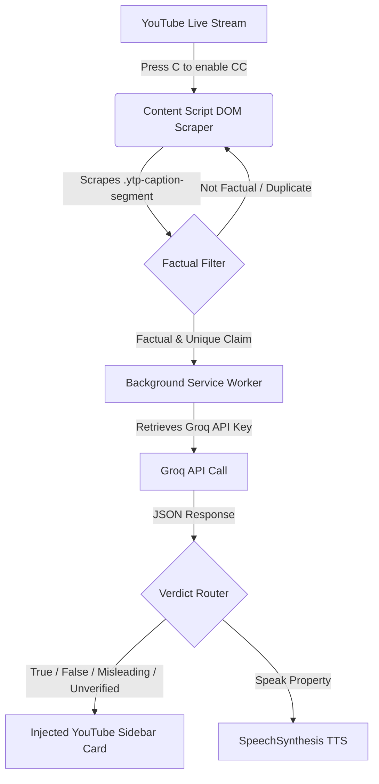

# ⚡ SachCheck – Indian News Fact-Checker

[](https://opensource.org/licenses/MIT)
[](#installation)
[](#architecture)
[](./CONTRIBUTING.md)

**SachCheck** is an open-source Chrome Extension designed to fact-check live Indian news broadcasts on YouTube in real time. Powered by Groq AI and using Llama 3 models, SachCheck automatically listens to live captions, identifies factual claims (about GDP, politics, statistics, etc.), runs them through high-performance LLMs, and presents a visual verdict card along with real-time text-to-speech voice announcements in both English and Hindi.

---

## 📖 Table of Contents

- [✨ Features](#-features)
- [🛠️ Architecture & How It Works](#️-architecture--how-it-works)
- [🚀 Installation & Setup](#-installation--setup)
- [💻 Developer Usage](#-developer-usage)
- [📂 Project Structure](#-project-structure)
- [🤝 Contributing Guidelines](#-contributing-guidelines)
- [📝 License](#-license)
- [🙌 Acknowledgements](#-acknowledgements)

---

## ✨ Features

- **Live Caption Scraping:** Monitors and extracts text segments directly from the YouTube Live player's caption overlay.
- **Intelligent Claim Filtering:** Uses pattern recognition (regex) to isolate factual claims (e.g., stats, political names, economic growth, currencies like *Crore* and *Lakh*) and filters out generic banter.
- **Groq AI-powered Verdicts:** Integrates Groq’s high-throughput API using fast Llama models (`llama-3.3-70b`, `llama-3.1-70b`, `llama-3.1-8b`, `mixtral`) to deliver split-second, structured truth analyses.
- **Multilingual Support:** Seamlessly fact-checks Hindi, Hinglish, and English text. Summary, evidence, and spoken verdicts adapt to the broadcast language.
- **Voice Verdicts (TTS):** Announces verdicts audibly via Chrome's SpeechSynthesis engine using natural-sounding Indian-English (`en-IN`) or Hindi (`hi-IN`) voices.
- **Chrome Side Panel UI:** Clean control dashboard in the Chrome Side Panel to toggle the extension, adjust settings, and save your API key.
- **In-page Sidebar Overlay:** Slides directly into the YouTube active tab to display a running log of fact-checked claims without interrupting the video view.

---

## 🛠️ Architecture & How It Works



1. **Scraping:** The `content.js` script polls the YouTube DOM every 1.5 seconds looking for active subtitle segments.
2. **Buffering & Deduplication:** Overlapping text frames are merged into a continuous buffer. An array-based history prevents duplicate checks on the same claim.
3. **Claim Extraction:** RegEx filters verify if the text segment contains factual claim markers (e.g. percentages, GDP indicators, political mentions).
4. **API Processing:** The claim is passed to the background service worker, which fetches a structured JSON analysis from the **Groq API** with low-latency LLMs.
5. **UI & Audio Feedback:** The side panel logs the statistics, the content script adds a card to the embedded sidebar showing the confidence score and evidence, and the TTS engine speaks the verdict.

---

## 🚀 Installation & Setup

Since SachCheck is currently in developer preview, you can load it locally:

### 1. Prerequisites
*   A Chromium-based browser (Google Chrome, Brave, Microsoft Edge, Opera).
*   A free **Groq API Key**. Get one from the [Groq Console](https://console.groq.com/).

### 2. Download the Codebase
```bash
git clone https://github.com/GunaTeja777/sachcheck.git
cd sachcheck
```

### 3. Load the Extension in Chrome
1. Open Chrome and navigate to `chrome://extensions/`.
2. Enable **Developer mode** (top-right toggle switch).
3. Click **Load unpacked** (top-left button).
4. Select the `sachcheck-v2` directory containing the `manifest.json` file.
5. SachCheck is now installed! Pin it from your extension jigsaw puzzle icon.

---

## 💻 Developer Usage

1. Open a YouTube Live broadcast of an Indian news channel (e.g. NDTV, Zee News, Republic TV, India Today).
2. Press **`C`** on your keyboard to make sure YouTube's Closed Captions (CC) are enabled.
3. Click the SachCheck action icon to open the Chrome **Side Panel**.
4. Paste your **Groq API Key** and click **Save**.
5. Click **▶ Start Fact-Checking**.
6. Watch the claims verify in real time on the floating right sidebar overlay!

---

## 📂 Project Structure

```text
sachcheck-v2/
├── manifest.json      # Extension metadata, permissions, and service worker routing
├── background.js     # Manages API routing, key storage, and dynamic tab injection
├── content.js        # DOM scraper, fact-checking loop, overlay panel renderer, and TTS
├── styles.css        # Visual styles for the in-page YouTube sidebar and cards
├── popup.html        # HTML layout for the Chrome Side Panel control center
├── popup.js          # Controller logic for the Chrome Side Panel
└── icons/            # Extension branding icon assets (16x16, 48x48, 128x128)
```

---

## 🤝 Contributing Guidelines

We love contributions! Whether you want to fix a bug, improve UI styles, add support for more news channels, or optimize the LLM system prompt, follow these steps to get started:

### 1. Search or Open an Issue
Before writing code, check the [Issues Tracker](https://github.com/GunaTeja777/sachcheck/issues) to make sure someone else isn't already working on it, or open a new issue to describe your proposed feature/fix.

### 2. Fork & Setup Branch
1. Fork the repository on GitHub.
2. Clone your fork locally.
3. Create a descriptive feature branch:
   ```bash
   git checkout -b feature/your-awesome-feature
   ```

### 3. Coding Guidelines
- Maintain standard vanilla JavaScript coding patterns (no external compilation dependencies like Webpack/Vite are required to run the extension).
- Ensure any visual UI changes are fully responsive and fit dark modes seamlessly.
- Preserve existing comment headers explaining core functions.

### 4. Testing Your Changes
- Make changes in `sachcheck-v2/`.
- Go to `chrome://extensions/` and click the **Reload** (refresh) icon on the SachCheck card.
- Open YouTube Live, verify that your changes are bug-free, and confirm console logs don't output unhandled exceptions.

### 5. Submit a Pull Request
1. Push your branch to your GitHub fork:
   ```bash
   git push origin feature/your-awesome-feature
   ```
2. Open a Pull Request (PR) to the `main` branch.
3. Provide a clear description of the changes, screenshots of UI edits if applicable, and write a summary explaining the problem solved.

---

## 📝 License

This project is open-source and licensed under the **MIT License**. See the [LICENSE](LICENSE) file for details.

---

## 🙌 Acknowledgements

- Built as an open-source tool to combat disinformation in live news broadcasts.
- Powered by [Groq Cloud](https://groq.com/) for lightning-fast inference times.
- Inspired by the open-source developer community in India.
